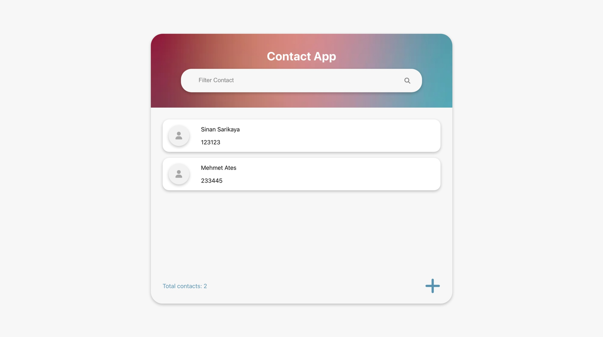

# React Contact App


Responsive contact app system made using React

<hr />

### Installation Options

```
$ git clone https://github.com/sinansarikaya/react-contact-app.git
```

```
$ npm install
```

```
$ npm start
```

<hr />

### Demo

#### [View Demo](https://reactcontacts-app.netlify.app/)



<hr />

### Try yourself

You can try to make it yourself by looking at the design in Figma.

#### [View the design in Figma](https://www.figma.com/file/47QCJEsZ9HbJf6h90KO1IU/React-Contact-App)
